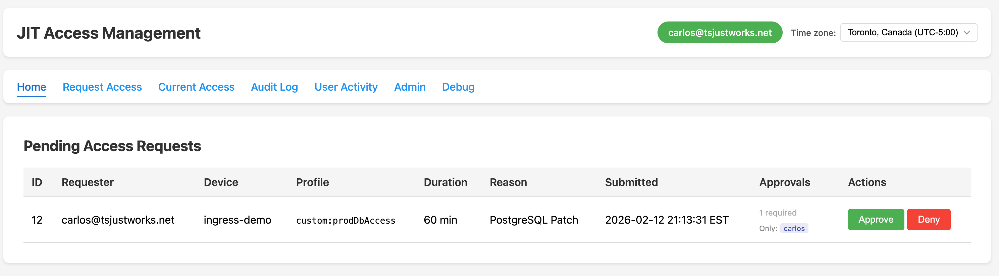

# Tailscale JIT (Just-In-Time) Access Management

A self-hosted web application for managing temporary access grants using Tailscale's custom posture attributes. Secure, time-limited access to resources with full audit logging and approval workflows: no Slack required.

## How It Works

```
User requests access  →  Approver reviews  →  Posture attribute set  →  ACL grants access  →  Auto-expires or manual revoke
```

1. **Request**: User selects which of their devices needs access and what access level is required, for a defined duration
2. **Approve**: Authorized approver reviews and approves/denies the request
3. **Grant**: App sets a posture attribute on the requesting device via the Tailscale API, unlocking the ACL rules that gate the target resource
4. **Access**: The requesting device now matches ACL rules requiring that posture attribute
5. **Expire or Revoke**: A background worker monitors all approved grants and calls the Tailscale API to delete the posture attribute when the duration elapses, marking the request as `expired` in the audit log. Approvers can also manually revoke any active grant at any time from the Current Access page.

## Features

- **Self-service access requests** with customizable duration (5 minutes to 24 hours)
- **Multi-approval workflows**: require N approvers before access is granted, configurable per profile
- **Real-time notifications** via WebSocket when requests are submitted, voted on, or approved
- **Automatic expiry**: background worker revokes grants via the Tailscale API when the duration elapses; no manual cleanup needed
- **Manual revocation**: approvers can revoke any active access grant on demand from the Current Access dashboard, with a required reason logged for audit
- **Comprehensive audit logging** of all requests, votes, approvals, denials, expirations, and permission rejections with full pagination and configurable retention
- **Real-time dashboard** showing currently active access grants with countdown timers
- **Granular permissions** controlling who can request, approve, and view access
- **Config-as-code**: profiles and approval rules live in `config.py`, versioned in git; the Admin page provides live overrides without redeploying
- **Self-approval prevention** (configurable)
- **Health check endpoint** (`/healthz`) for monitoring
- **Configurable access profiles** via environment variables or code
- **Zero passwords**: authentication is entirely handled by Tailscale

## Screenshot



## Architecture

```
  Your Device (browser)
         │
         │  WireGuard / Tailscale network
         ▼
┌─────────────────────────────────────────────────────────┐
│  Linux VM (tailscaled running)                          │
│                                                         │
│  ┌──────────────────────────────────────────────────┐   │
│  │  tailscaled  (port 443, Tailscale Serve)         │   │
│  │                                                  │   │
│  │  1. Authenticates connecting node via WireGuard  │   │
│  │  2. Injects headers:                             │   │
│  │       Tailscale-User-Login: you@example.com      │   │
│  │       Tailscale-App-Capabilities: {...}          │   │
│  │  3. Forwards to Flask on localhost               │   │
│  └───────────────────┬──────────────────────────────┘   │
│                      │ localhost only                   │
│                      ▼                                  │
│  ┌──────────────────────────────────────────────────┐   │
│  │  Flask / Gunicorn  (127.0.0.1:5000)              │   │
│  │                                                  │   │
│  │  - Reads identity from injected headers          │   │
│  │  - Access request workflow + approval voting     │   │
│  │  - Multi-approval + authorized approvers logic   │   │
│  │  - Audit logging                                 │   │
│  │  - Admin configuration page                      │   │
│  │                                                  │   │
│  │  SQLite DB                                       │   │
│  │  - access_requests   - approval_votes            │   │
│  │  - approval_rules    - authorized_approvers      │   │
│  │  - audit_log         - user_activity             │   │
│  └───────────────────┬──────────────────────────────┘   │
│                      │ HTTPS (OAuth + device API)       │
└──────────────────────┼──────────────────────────────────┘
                       ▼
             ┌───────────────────┐
             │  Tailscale API    │
             │  api.tailscale.com│
             │                   │
             │  - List devices   │
             │  - Set posture    │
             │    attributes     │
             └───────────────────┘
```

**Authentication model**: `tailscale serve --accept-app-caps` handles identity injection natively - no separate identity provider needed. Flask trusts the injected headers and binds to `127.0.0.1` only, making header forgery impossible from outside the host.

## Prerequisites

- **Linux** (Ubuntu 22.04+ recommended) or any system that can run Python 3.9+
- **Tailscale** installed and authenticated on the host
- **OAuth Client** with `devices:read` and `devices:write` scopes
- Admin access to your Tailscale tailnet ACL

## Quick Start

See **[QUICKSTART.md](QUICKSTART.md)** to get running in 15 minutes.

## Deployment Options

### Option A: Standalone (Recommended)

Best for most deployments. Runs directly on a Linux VM alongside Tailscale.

#### Step 1: Have these ready before you start

- **Tailscale installed and authenticated** on the host: run `tailscale status` and confirm it shows connected
- **OAuth client credentials**: create one at [login.tailscale.com/admin/settings/oauth](https://login.tailscale.com/admin/settings/oauth) with `devices:read` and `devices:write` scopes; copy the client ID and secret somewhere handy
- **Your tailnet domain**: shown in the Tailscale admin console, looks like `example.ts.net`
- **Your capability domain**: the domain you use in your ACL grants, e.g. `yourdomain.com/cap/jit-access`
- Ubuntu/Debian host (the script uses `apt-get` to install Python if it is missing)

#### Step 2: Run the setup script

Clone the repo and run the script from the repo root:

```bash
git clone https://github.com/ccatprd/tailscale-jit-access.git
cd tailscale-jit-access
sudo bash deploy/setup.sh
```

The script creates a `jitaccess` system user, copies the app to `/opt/tailscale-jit-access/`, sets up a Python virtualenv, installs dependencies, generates a random `FLASK_SECRET_KEY`, and installs two systemd units. It does not start anything yet.

#### Step 3: Fill in your credentials

Open `/opt/tailscale-jit-access/.env` in any editor and fill in the four required values:

```
TAILSCALE_CLIENT_ID=your-oauth-client-id
TAILSCALE_CLIENT_SECRET=your-oauth-client-secret
TAILSCALE_TAILNET=your-tailnet.ts.net
CAP_DOMAIN=yourdomain.com/cap/jit-access
```

`FLASK_SECRET_KEY` is already set: the script generated it automatically.

#### Step 4: Set your capability domain in the Tailscale Serve service

Open `/etc/systemd/system/tailscale-serve.service` and replace `yourdomain.com/cap/jit-access` with your actual capability domain. This must match what you put in your ACL grants exactly.

#### Step 5: Tag this device and start the services

The server must carry the `tag:jit-access-app` tag so your ACL grants apply to it. Two options:

- **Via auth key (recommended):** Go to [tailscale.com/admin/settings/keys](https://tailscale.com/admin/settings/keys), create a new auth key, add `tag:jit-access-app` under Tags, then run:
  ```bash
  sudo tailscale up --auth-key=<your-tagged-auth-key>
  ```
- **Via Admin UI:** Go to [tailscale.com/admin/machines](https://tailscale.com/admin/machines), find your server, click the three-dot menu, select **Edit tags**, and add `tag:jit-access-app`.

Then reload and start the services:

```bash
# Reload systemd so it picks up the new service files
sudo systemctl daemon-reload

# Start both services and enable them to run on boot
sudo systemctl enable --now jit-access
sudo systemctl enable --now tailscale-serve
```

#### Step 6: Confirm it is running and find your URL

```bash
# Both should show "active (running)"
sudo systemctl status jit-access
sudo systemctl status tailscale-serve

# Quick sanity check: should return {"status":"ok",...}
curl http://localhost:5000/healthz
```

Your app is now accessible over HTTPS on your tailnet at:

```
https://<this-hostname>.<your-tailnet>.ts.net/
```

For example, if your server is named `jit-server` and your tailnet is `example.ts.net`, the URL is `https://jit-server.example.ts.net/`. Open that in a browser on any device connected to your tailnet and you should see the JIT Access interface.

If you see a permissions error instead of the UI, check that `--accept-app-caps` in your `tailscale-serve.service` matches your ACL capability domain exactly, and that your ACL grants are in place.

### Option B: Docker

For users who prefer containers. Note: **Tailscale Serve must still run on the host**.

```bash
# 1. Configure
cp .env.example .env
# Edit .env with your Tailscale credentials

# 2. Start
docker compose up -d

# 3. Configure Tailscale Serve on the host
tailscale serve --bg --accept-app-caps=yourdomain.com/cap/jit-access http://127.0.0.1:5000
```

The Docker setup binds to `127.0.0.1:5000` only: Tailscale Serve handles external HTTPS access.

## Configuration

All configuration is via environment variables. See **[.env.example](.env.example)** for the full list.

### Required

| Variable | Description |
|----------|-------------|
| `TAILSCALE_CLIENT_ID` | OAuth client ID from Tailscale admin |
| `TAILSCALE_CLIENT_SECRET` | OAuth client secret |
| `TAILSCALE_TAILNET` | Your tailnet domain (e.g., `example.ts.net`) |
| `FLASK_SECRET_KEY` | Random 32+ character secret for session signing |

### Optional

| Variable | Default | Description |
|----------|---------|-------------|
| `CAP_DOMAIN` | *(required - no working default)* | Capability domain matching your ACL, e.g. `yourdomain.com/cap/jit-access` |
| `DB_PATH` | `jit_access.db` | SQLite database file path |
| `DEVICE_CACHE_TTL` | `300` | Device cache TTL in seconds |
| `TOKEN_CACHE_TTL` | `3000` | OAuth token cache TTL in seconds |
| `ALLOW_SELF_APPROVE` | `false` | Allow users to approve their own requests. Disabled by default; set to `true` only for dev or single-user installs. |
| `DEFAULT_REQUIRED_APPROVALS` | `1` | Default number of approvals required when no profile-specific rule is configured. Can be overridden per profile via the Admin page. |
| `AUDIT_LOG_RETENTION_DAYS` | `365` | Days to retain audit and activity log rows. Set to `0` to keep indefinitely. Pruning runs at startup and on each background worker cycle. |
| `AUDIT_PAGE_SIZE` | `100` | Rows per page on the Audit Log and Activity pages (min 10, max 500). |
| `EXPIRY_CHECK_INTERVAL` | `60` | Seconds between background worker cycles. Each cycle revokes any expired grants via the Tailscale API and prunes old log rows. |

### Access Profiles and Approval Rules

Profiles and default approval rules are defined in **`config.py`** at the repository root. This file is versioned in git, so every change is tracked, reviewable, and rollback-able.

```python
# config.py
ACCESS_PROFILES = [
    {"id": "custom:prodDbAccess",  "name": "Production Database Access"},
    {"id": "custom:sshAccess",     "name": "SSH Access"},
]

APPROVAL_RULES = {
    "custom:prodDbAccess": {
        "required_approvals": 2,
        "authorized_approvers": [
            {"email": "alice@example.com", "required": True},
        ],
    },
}
```

All profile IDs must start with `custom:` (Tailscale requirement).

On startup, the app seeds `APPROVAL_RULES` into the database for any profile that has no existing rule. If the Admin page has already written a rule for that profile, the database value wins - config.py is never silently applied on top of live changes.

**Two-layer model:**

| Layer | Where | Wins? |
|-------|-------|-------|
| `config.py` | Git, deployed with code | Used on first startup / fresh DB |
| Admin page (`/admin`) | Live DB override | Always takes precedence |

To capture Admin page changes back into git: click **Export to config.py** on the Admin page, paste the output into `config.py`, and commit.

## ACL Setup

Your Tailscale ACL needs three things:

### 1. Grant Permissions to the JIT App

```json
{
  "grants": [
    {
      "src": ["admin@example.com"],
      "dst": ["tag:jit-access-app"],
      "app": {
        "yourdomain.com/cap/jit-access": [{
          "can_request_access": true,
          "can_approve_requests": true,
          "can_view_current_access": true,
          "can_view_audit": true,
          "can_view_debug": true,
          "can_admin_config": true
        }]
      }
    },
    {
      "src": ["autogroup:member"],
      "dst": ["tag:jit-access-app"],
      "app": {
        "yourdomain.com/cap/jit-access": [{
          "can_request_access": true
        }]
      }
    }
  ],
  "tagOwners": {
    "tag:jit-access-app": ["admin@example.com"]
  }
}
```

### 2. Define Posture Checks

```json
{
  "postures": {
    "posture:hasProdDbAccess": [
      "node:tailscaleCustom:prodDbAccess == true"
    ]
  }
}
```

### 3. Use Posture in Access Rules

```json
{
  "grants": [{
    "src": ["autogroup:member"],
    "dst": ["tag:database-servers"],
    "ip": ["5432"],
    "srcPosture": ["posture:hasProdDbAccess"]
  }]
}
```

See **[acl-example.json](acl-example.json)** for a complete working ACL configuration.

### Tag Your Device

The server must carry the `tag:jit-access-app` tag so your ACL grants apply to it. Two options:

- **Via auth key (recommended):** Go to [tailscale.com/admin/settings/keys](https://tailscale.com/admin/settings/keys), create a new auth key, add `tag:jit-access-app` under Tags, then run:
  ```bash
  sudo tailscale up --auth-key=<your-tagged-auth-key>
  ```
- **Via Admin UI:** Go to [tailscale.com/admin/machines](https://tailscale.com/admin/machines), find your server, click the three-dot menu, select **Edit tags**, and add `tag:jit-access-app`.

### Configure Tailscale Serve

If you used `setup.sh` (Option A), the `tailscale-serve.service` systemd unit handles this automatically - you already did this in Step 4 when you edited and started that service.

If you are running manually or via Docker, start Tailscale Serve once:

```bash
tailscale serve --bg --accept-app-caps=yourdomain.com/cap/jit-access http://127.0.0.1:5000
```

The `--accept-app-caps` flag is what passes permissions from the ACL into the `Tailscale-App-Capabilities` header that the application reads.

## Permissions Model

| Permission | Description |
|-----------|-------------|
| `can_request_access` | Submit access requests |
| `can_approve_requests` | Approve or deny pending requests, cast approval votes, revoke active access |
| `can_view_current_access` | View active access grants dashboard |
| `can_view_audit` | View audit logs and user activity |
| `can_view_debug` | View debug information and Tailscale headers |
| `can_admin_config` | Configure required approvals and authorized approvers per profile via the Admin page |

Navigation tabs are automatically hidden when the user lacks the required permission.

## Multi-Approval Workflows

By default every request requires one approval. To require more, use either approach:

**Option A - config.py (versioned, recommended):** set `required_approvals` in `APPROVAL_RULES` and redeploy. Rules are seeded into the DB on startup if no live override exists.

**Option B - Admin page (live, no redeploy):** grant yourself `can_admin_config` in your ACL, visit `/admin`, and set the required approvals per profile. This writes a DB override that takes precedence over `config.py`. Use the Export button to sync back to git when ready.

Requests for profiles requiring N approvals stay pending until N distinct approvers vote; the Tailscale posture attribute is only set once the quorum is reached.

Key rules:

- Each approver can vote exactly once per request
- Any single approver can deny the request at any time, cancelling it immediately
- If `ALLOW_SELF_APPROVE=false`, the requester's vote does not count
- The `approver` field stored in the DB and audit log lists all voters who contributed to a final approval
- The `DEFAULT_REQUIRED_APPROVALS` env var sets the fallback when no profile-specific rule exists

## Authorized Approvers

For sensitive profiles, you can restrict approval to specific named users. In the Admin page, set up to 3 email addresses as authorized approvers for a profile. When set:

- Only those users can approve (or vote on) requests for that profile, even if others have `can_approve_requests`
- The Home page shows the authorized approver names on each request so requesters know who to contact
- Users who lack authorization see a "Restricted" button instead of "Approve"
- Leave the field empty to allow anyone with `can_approve_requests` to approve

Authorized approvers and required approvals work together: a profile can require 2 approvals and only allow 3 specific users to vote, meaning 2 of those 3 must agree before access is granted.

## How Authentication Works

No separate identity provider is needed. `tailscale serve --accept-app-caps=...` handles everything natively inside `tailscaled`.

When a request arrives at port 443 of your Tailscale address, `tailscaled` identifies the connecting node cryptographically (via its WireGuard keypair and node certificate), looks up that identity's ACL grants for your capability domain, and injects two headers before forwarding the request to Flask on localhost:

- `Tailscale-User-Login: user@example.com` - the authenticated user's email
- `Tailscale-App-Capabilities: {...}` - their serialized permission grants

Flask reads these headers and trusts them completely. This is safe because Flask binds to `127.0.0.1` only - nothing can reach it except `tailscaled` running on the same machine.

Quick verification: visit `/debug` in the app and check that `Tailscale-App-Capabilities` contains your permission JSON.

## Operations

### Updating

To pull the latest code and restart the service in one step:

```bash
cd ~/tailscale-jit-access
sudo bash deploy/update.sh
```

This pulls from git, copies updated files to `/opt/tailscale-jit-access/`, installs any new dependencies, and restarts the service.

### Health Check

```bash
curl http://localhost:5000/healthz
# {"status":"ok","version":"1.1.0","database":"ok"}
```

### Database Backup

```bash
sqlite3 /opt/tailscale-jit-access/jit_access.db ".backup 'backup-$(date +%Y%m%d).db'"
```

### Logs

```bash
# Systemd
sudo journalctl -u jit-access -f

# Docker
docker compose logs -f
```

## API Reference

| Endpoint | Method | Description |
|----------|--------|-------------|
| `/api/devices` | GET | List Tailscale devices |
| `/api/request` | POST | Submit access request (JSON) |
| `/api/approve/<id>` | POST | Approve a pending request |
| `/api/deny/<id>` | POST | Deny a pending request (JSON body with `reason`) |
| `/api/revoke/<id>` | POST | Revoke an active access grant (JSON body with `reason`) |
| `/healthz` | GET | Health check (no auth required) |

## Security Considerations

- **No passwords stored**: Authentication is entirely via Tailscale headers
- **ACL-enforced permissions**: All authorization comes from Tailscale ACL grants
- **Audit everything**: Every action logged with user, timestamp, and IP
- **Automatic expiry + manual revoke**: Background worker actively revokes posture attributes when grants expire. Approvers can also revoke any active grant immediately from the Current Access page, removing the posture attribute on the spot.
- **HTTPS only**: Tailscale Serve provides automatic TLS certificates
- **Input validation**: All request fields validated with strict regex patterns
- **Self-approval prevention**: On by default (`ALLOW_SELF_APPROVE=false`); requesters cannot approve their own requests
- **Localhost binding**: App only listens on `127.0.0.1`; Tailscale Serve handles external access
- **Non-root execution**: Systemd service and Docker both run as unprivileged user

### File Permissions

```bash
chmod 600 /opt/tailscale-jit-access/.env           # Secrets: owner only
chmod 644 /opt/tailscale-jit-access/jit_access.db  # Database
```

## Troubleshooting

### Permissions Not Working

1. Visit `/debug`: check `Tailscale-App-Capabilities` header
2. If empty: verify `--accept-app-caps` in `tailscale-serve.service` matches your ACL capability domain exactly (e.g. `yourdomain.com/cap/jit-access`)
3. Verify the ACL grants are saved and your device has the `tag:jit-access-app` tag
4. ACL changes can take up to 60 seconds to propagate; run `tailscale serve status` to confirm serve is active

### Devices Not Loading

1. Check OAuth client has `devices:read` scope
2. Check logs: `sudo journalctl -u jit-access -f`
3. Test OAuth manually:
   ```bash
   curl -X POST https://api.tailscale.com/api/v2/oauth/token \
     -d "client_id=YOUR_ID&client_secret=YOUR_SECRET"
   ```

### Application Won't Start

```bash
# Check FATAL errors: usually missing environment variables
sudo journalctl -u jit-access --no-pager | head -20

# Verify Python version (3.9+ required)
python3 --version

# Verify dependencies
/opt/tailscale-jit-access/venv/bin/pip list
```

### Database Locked

The app runs SQLite in WAL mode, which allows concurrent reads and greatly reduces locking. If you still see "database is locked":
1. Ensure only one instance is running: `ps aux | grep gunicorn`
2. Check file permissions on the `.db` file: the `jitaccess` user must own it

## Roadmap

- [ ] Microsoft Teams integration (approval notifications via Teams bot)
- [ ] Email notifications for request status changes
- [ ] Pending request expiry (auto-deny if no approver acts within N hours)

## Contributing

See **[CONTRIBUTING.md](CONTRIBUTING.md)** for guidelines.

## License

MIT License: see [LICENSE](LICENSE) for details.

## Acknowledgments

Built with [Flask](https://flask.palletsprojects.com/), [Flask-SocketIO](https://flask-socketio.readthedocs.io/), [Tailscale](https://tailscale.com/), and [SQLite](https://www.sqlite.org/).
